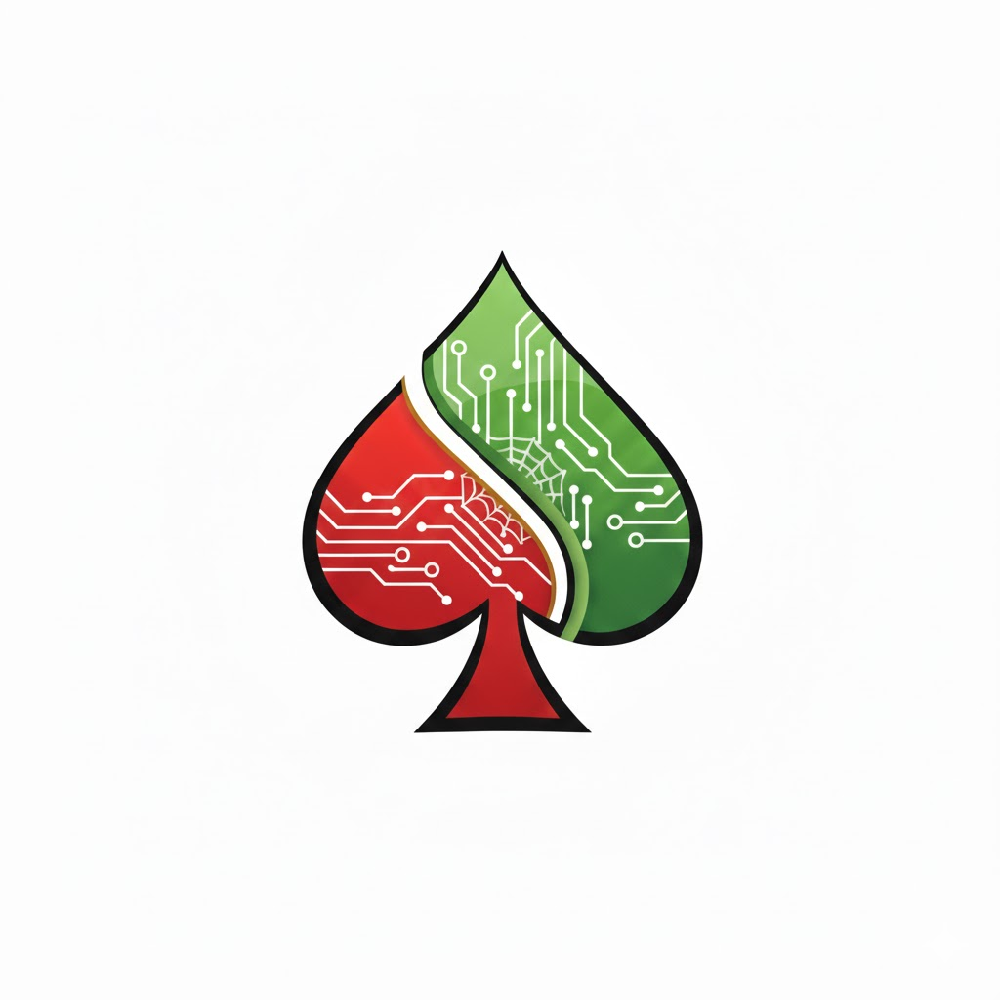

  

<h1 align="center">Spader</h1>

  iOS app for managing lecture schedules, assignments, and academic notes for UPN "Veteran" Yogyakarta students

  
  
  
  
  

---

## Screenshots

  
  
  
  
  

  
  
  

---

## Features

### Lecture Schedule
- View all schedules grouped by day
- Filter to show only today's classes
- Auto-highlight ongoing and upcoming classes
- Search schedules by course name or lecturer
- Each course has a customizable unique color
- Course detail: name, lecturer, room, and personal notes

### Schedule Input
- Auto-import schedule from text (SIAKAD format / copy-paste)
- Manual input per course if needed
- Edit and delete schedules anytime

### Task Management
- Add tasks with title, description, course, deadline, and priority (Low / Medium / High)
- Automatic task status: Active, Done, or Overdue
- Time remaining indicator (minutes, hours, days)
- Deadline reminder notifications with a "Mark as Done" action directly from the notification
- Filter tasks by status

### Calendar
- Monthly calendar view
- Add notes to specific dates
- View scheduled courses on the selected day

### Profile & GPA
- Set username with profile photo
- Record GPA per semester
- GPA progress chart across semesters (using Swift Charts)

### Notifications
- Reminder notifications before class starts
- Configure number of reminders (1–5 times) and interval between reminders
- Deadline notifications that can be marked done directly from the notification

### Appearance & Language
- Dark / light / system appearance support
- Bilingual: Indonesian and English
- Adaptive gradient background based on color scheme

### iOS Widget
- Home screen widget displaying today's lecture schedule

---

## Tech Stack

| Component | Detail |
|---|---|
| Platform | iOS 17+ |
| Language | Swift 5.9 |
| UI Framework | SwiftUI |
| Data Persistence | `UserDefaults` via `@AppStorage` |
| Notifications | `UserNotifications` framework |
| Charts | Swift Charts |
| Widget | WidgetKit |

---

## Getting Started

1. Clone this repo
2. Open `spader.xcodeproj` in Xcode 15+
3. Select a device or simulator (iOS 17+)
4. Build & Run (`Cmd + R`)

No external dependencies need to be installed via SPM — everything is included in the project.

---

## License

Distributed under the MIT License. See `LICENSE` for more information.

---

## Developer

Built by **Wildan Rifqi** — Informatics student at UPN "Veteran" Yogyakarta.
