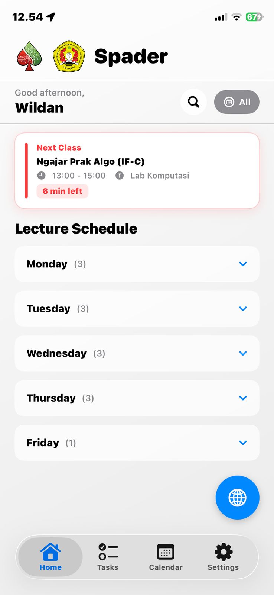
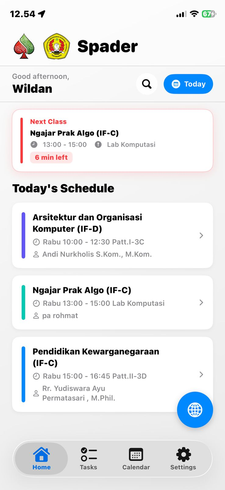
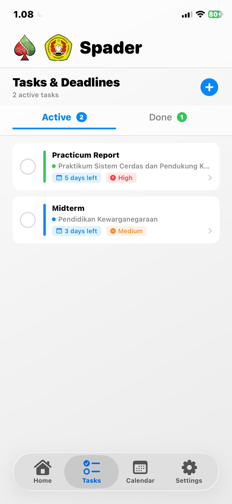
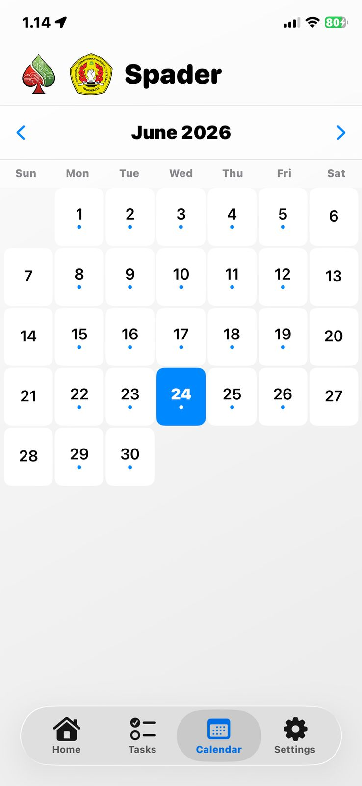
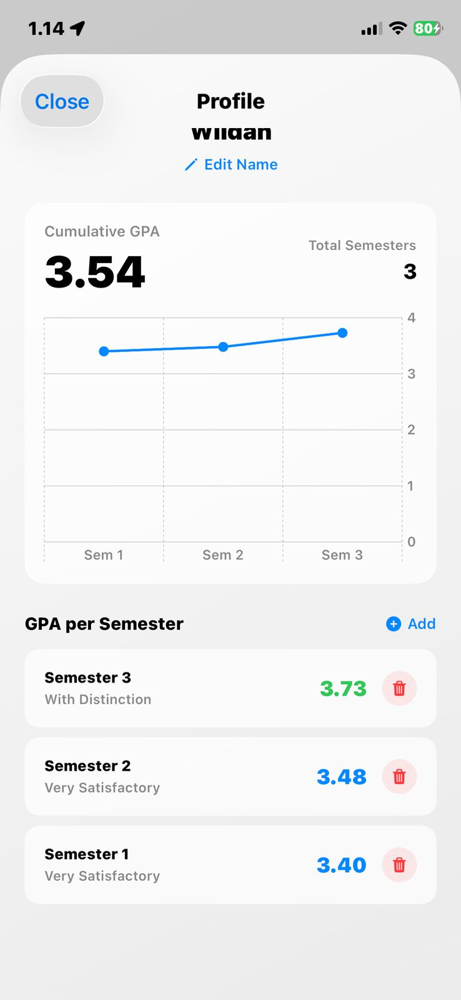
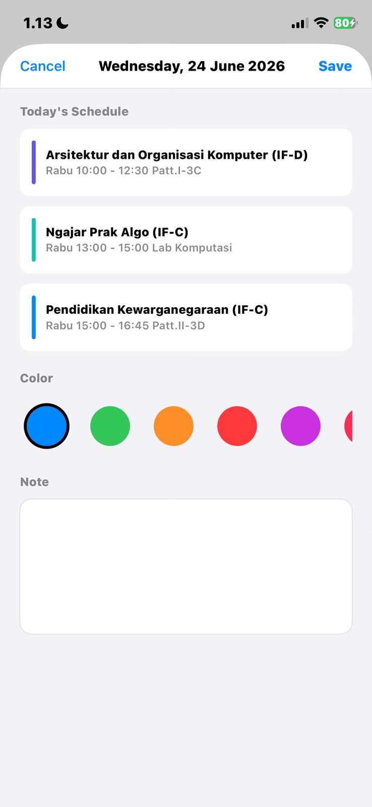
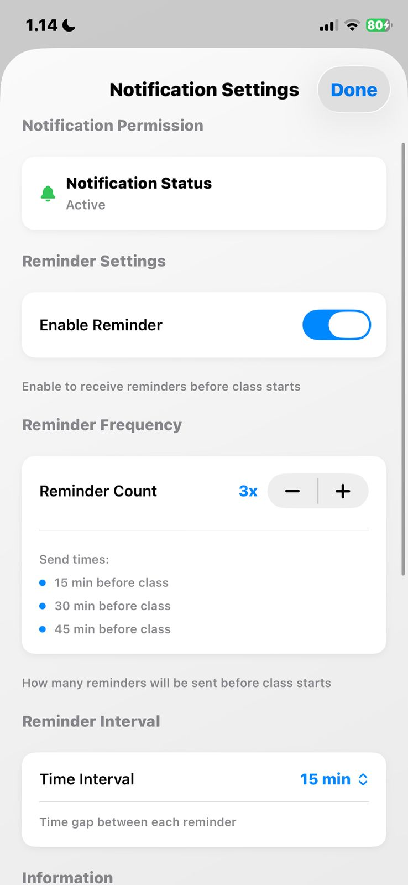
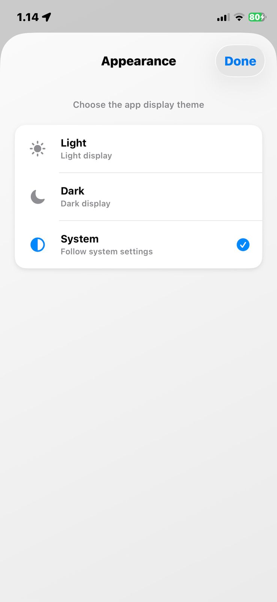

# Spader

Spader adalah aplikasi manajemen jadwal kuliah berbasis iOS, dibuat khusus untuk mahasiswa UPN "Veteran" Yogyakarta. Aplikasi ini membantu kamu mengelola jadwal kuliah, tugas, dan catatan akademik dalam satu tempat, dengan tampilan yang bersih, notifikasi pintar, dan dukungan dua bahasa.

---

## Screenshots

  
  
  
  
  

  
  
  

---

## Fitur

### Jadwal Kuliah
- Tampilkan seluruh jadwal kuliah yang dikelompokkan per hari
- Filter jadwal untuk melihat kuliah hari ini saja
- Highlight otomatis kelas yang sedang berlangsung atau akan dimulai berikutnya
- Pencarian jadwal berdasarkan nama mata kuliah atau dosen
- Setiap mata kuliah memiliki warna unik yang bisa dikustomisasi
- Detail kuliah: nama matkul, dosen, ruangan, dan catatan pribadi

### Input Jadwal
- Import jadwal otomatis dari teks (format SIAKAD / copy-paste)
- Input manual per mata kuliah jika diperlukan
- Edit dan hapus jadwal kapan saja

### Manajemen Tugas
- Tambah tugas dengan judul, deskripsi, mata kuliah, deadline, dan prioritas (Rendah / Sedang / Tinggi)
- Status tugas otomatis: Aktif, Selesai, atau Terlambat
- Indikator waktu tersisa (menit, jam, hari)
- Notifikasi pengingat deadline tugas dengan aksi "Tandai Selesai" langsung dari notifikasi
- Filter tugas berdasarkan status

### Kalender
- Tampilan kalender bulanan
- Tambah catatan pada tanggal tertentu
- Lihat jadwal kuliah yang terjadwal pada hari yang dipilih

### Profil & IPK
- Input nama pengguna dengan foto profil
- Catat IPK per semester
- Grafik perkembangan IPK antar semester (menggunakan Swift Charts)

### Notifikasi
- Notifikasi pengingat sebelum kuliah dimulai
- Konfigurasi jumlah pengingat (1–5 kali) dan jarak waktu antar pengingat
- Notifikasi deadline tugas yang bisa langsung ditandai selesai

### Tampilan & Bahasa
- Dukungan mode gelap / terang / ikut sistem
- Bilingual: Bahasa Indonesia dan English
- Gradient background adaptif sesuai color scheme

### iOS Widget
- Widget layar utama yang menampilkan jadwal kuliah hari ini

---

## Tech Stack

| Komponen | Detail |
|---|---|
| Platform | iOS 17+ |
| Language | Swift 5.9 |
| UI Framework | SwiftUI |
| Data Persistence | `UserDefaults` via `@AppStorage` |
| Notifications | `UserNotifications` framework |
| Charts | Swift Charts |
| Widget | WidgetKit |

---

## Cara Build

1. Clone repo ini
2. Buka `spader.xcodeproj` di Xcode 15+
3. Pilih target device atau simulator (iOS 17+)
4. Build & Run (`Cmd + R`)

Tidak ada dependency eksternal yang perlu di-install via SPM, semua sudah tercakup di dalam proyek.

---

## Developer

Dibuat oleh **Wildan Rifqi** — Mahasiswa Informatika, UPN "Veteran" Yogyakarta.
